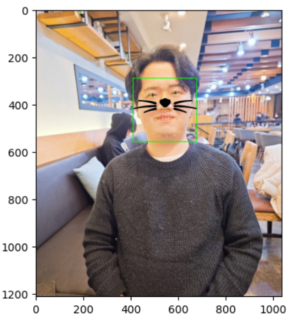
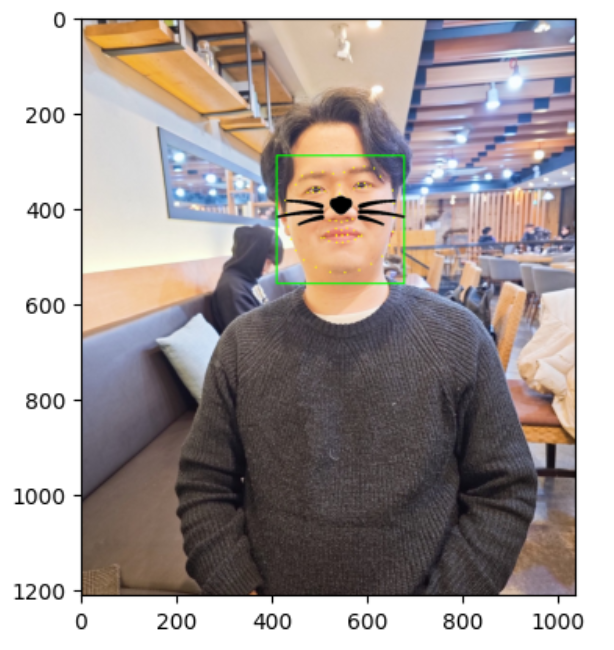

🔑 **PRT(Peer Review Template)**

- [x] **1. 주어진 문제를 해결하는 완성된 코드가 제출되었나요? (완성도)**
  - [x] 1. 자기만의 카메라앱 기능 구현을 완수하였다.        
  - [x] 2. 스티커 이미지를 정확한 원본 위치에 반영하였다.        
  - [ ] 3. 카메라 스티커앱을 다양한 원본이미지에 적용했을 때의 문제점을 체계적으로 분석하였다.   
        
- [x] **2. 프로젝트에서 핵심적인 부분에 대한 설명이 주석(닥스트링) 및 마크다운 형태로 잘 기록되어있나요? (설명)**

- [x] **3. 체크리스트에 해당하는 항목들을 모두 수행하였나요? (문제 해결)**
  - [x] 각 실험을 시각화하여 비교하였나요?
  - [ ] 모든 실험 결과가 기록되었나요?    
        
- [x] **4. 프로젝트에 대한 회고가 상세히 기록 되어 있나요? (회고, 정리)**
      - [X] 배운 점
      - [X] 아쉬운 점
      - [X] 느낀 점
      - [X] 어려웠던 점    
      
