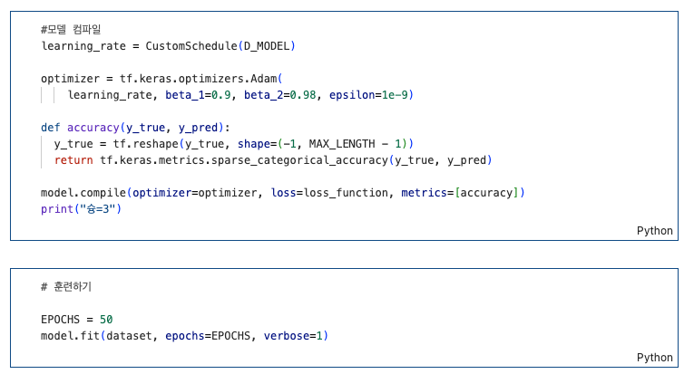
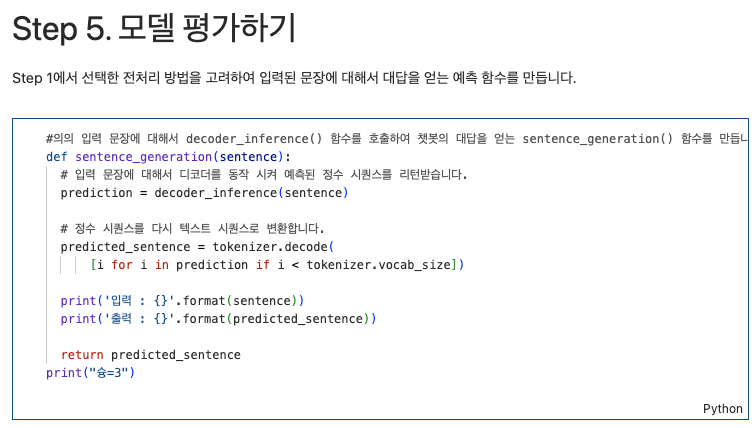
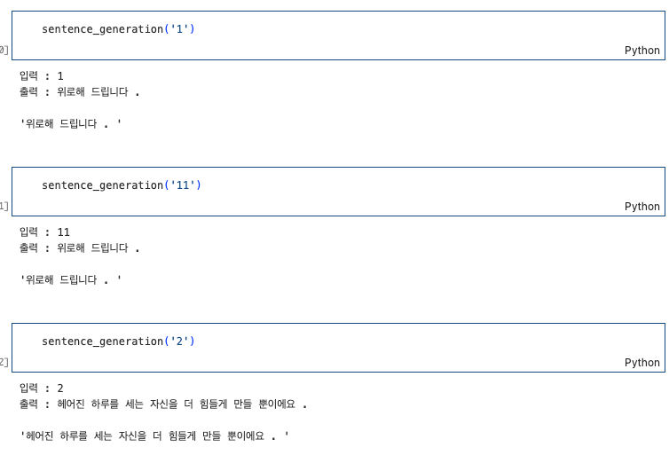

<aside>
🔑 **PRT(Peer Review Template)**   

리뷰어 : 김성연

- [x]  **1. 주어진 문제를 해결하는 완성된 코드가 제출되었나요? (완성도)**
    - 문제에서 요구하는 최종 결과물이 첨부되었는지 확인
    - 문제를 해결하는 완성된 코드란 프로젝트 루브릭 3개 중 2개, 
    퀘스트 문제 요구조건 등을 지칭
        - 해당 조건을 만족하는 부분의 코드 및 결과물을 캡쳐하여 사진으로 첨부

**1. 한국어 전처리를 통해 학습 데이터셋을 구축하였다.**
```python
# 전처리 함수
def preprocess_sentence(sentence):
    sentence = sentence.strip()
    # 구두점과 한글 사이에 공백 추가
    sentence = re.sub(r"([?.!,])", r" \1 ", sentence)
    sentence = re.sub(r'[" "]+', " ", sentence)
    # 한글과 구두점을 제외한 모든 문자를 공백으로 대체
    sentence = re.sub(r"[^가-힣?0-9?.!,]+", " ", sentence) #허용할 부분, 나머지 공백
    return sentence
print("슝=3")
```
- 데이터 전처리를 데이터셋에 맞게 잘 하셨습니다

**2. 트랜스포머 모델을 구현하여 한국어 챗봇 모델 학습을 정상적으로 진행하였다.**

- 50 에폭으로 훈련하여 좋은 결과를 얻어낸 것 같습니다

**3. 한국어 입력문장에 대해 한국어로 답변하는 함수를 구현하였다.**

- 한국어를 답변하는 함수를 통해 테스트를 진행하셨습니다


- []  **2. 프로젝트에서 핵심적인 부분에 대한 설명이 주석(닥스트링) 및 마크다운 형태로 잘 기록되어있나요? (설명)**
    - []  모델 선정 이유
    - []  Metrics 선정 이유
    - []  Loss 선정 이유

- []  **3. 체크리스트에 해당하는 항목들을 모두 수행하였나요? (문제 해결)**
    - []  데이터를 분할하여 프로젝트를 진행했나요? (train, validation, test 데이터로 구분)
    - []  하이퍼파라미터를 변경해가며 여러 시도를 했나요? (learning rate, dropout rate, unit, batch size, epoch 등)
    - []  각 실험을 시각화하여 비교하였나요?
    - [x]  모든 실험 결과가 기록되었나요?


- 에폭별 실험결과가 나오지 않아서 아쉬웠지만 숫자 입력에 대해 값들을 비교해본 것이 인상싶었습니다

- [x]  **4. 프로젝트에 대한 회고가 상세히 기록 되어 있나요? (회고, 정리)**
    - [x]  배운 점
    - [x]  아쉬운 점
    - [x]  느낀 점
    - [x]  어려웠던 점

```text
배운 점 : 챗봇의 원리에 대해서 알 수 있었다.

아쉬운 점 : 결과물적으론 디테일한 답변이 안나오는게 아쉬웠다

느낀 점 : 어떻게하면 더 깊은 대화와 정확도를 올릴 수 있을지 고민되었다.

어려웠던 점 : 부족한 코딩 실력에 csv호출하고 연결하는 과정이 어려웠다
혼자서 이 문제만 2-3시간 넘게 해결해보았는데 팀원의 도움으로 간단하게 해결되었다
간단한 것에서 부딪치지 않도록 여러 상황을 겪어봐야겠다
```

</aside>
